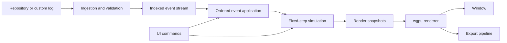

# Gource Rust Fork

## 1. Status and Purpose

**Status: Draft concept for implementation by an autonomous coding agent.**

Develop a Rust successor to Gource using `wgpu`, `winit`, and `egui`. Preserve its recognizable repository-history visualization while improving architecture, responsiveness, scalability, and video export.

This specification establishes the initial direction, not a fixed design. The agent shall improve the design during implementation and may deviate when inspection, tests, or measurements justify a better solution for this fork.

The agent shall:

- Inspect the upstream implementation before assuming its behavior or algorithms.
- Prefer small, testable changes and working vertical slices.
- Record material deviations, evidence, and consequences in `docs/decisions.md`.
- Preserve established compatibility unless an intentional change is documented.
- Request approval before changing licensing, removing major capabilities, introducing required external services, or replacing the selected technology stack.
- Never report unexecuted tests or unmeasured performance improvements as verified results.

## 2. Goals

### Required

- Native execution on Windows, macOS, and Linux.
- Implementation with Rust **1.98.1**.
- Rendering through `wgpu`, using WGSL shaders.
- Window and input management through `winit`.
- Application controls through `egui`.
- Repository history represented as an evolving directory/file hierarchy with contributor activity.
- Responsive playback, camera controls, timeline navigation, and filtering.
- Offscreen frame generation and video export.
- Explicit separation of ingestion, playback, simulation, rendering, and UI.
- Measured CPU parallelism and bounded inter-stage concurrency.

### Deferred

- Browser deployment.
- GPU-based layout simulation.
- Direct Vulkan integration.
- Hosted services, collaboration, and remote rendering.
- Broad feature parity with every upstream option.

Deferred features shall not complicate the initial implementation without a demonstrated requirement.

## 3. Technology and Dependency Policy

| Concern | Initial choice |
|---|---|
| Toolchain | Rust 1.98.1, pinned in `rust-toolchain.toml` |
| Graphics | `wgpu`, WGSL |
| Window and input | `winit` |
| UI integration | `egui`, `egui-winit`, `egui-wgpu` |
| CPU data parallelism | Rayon |
| Inter-stage communication | Bounded channels and reusable snapshot buffers |
| Diagnostics | `tracing`, CPU profiling, supported GPU timing |
| Video encoding | External FFmpeg process initially |

Select mutually compatible crate versions, verify their toolchain requirements, and commit `Cargo.lock`. Avoid incompatible duplicate graphics dependencies.

Use native `wgpu` backends. Do not implement direct Vulkan or introduce Dioxus, Loco, or a general-purpose engine without an approved decision.

Do not add an asynchronous runtime unless actual I/O requirements justify it. CPU-intensive work belongs on bounded worker pools, not asynchronous executor threads.

## 4. Architecture

Organize the Cargo workspace around these responsibilities:

| Crate | Responsibility |
|---|---|
| `gource-core` | Stable identifiers, normalized events, repository hierarchy, playback semantics, configuration |
| `gource-ingest` | Source adapters, parsing, validation, event indexing, cache management |
| `gource-sim` | Layout, contributor motion, animation state, simulation snapshots |
| `gource-render` | GPU resources, pipelines, text, effects, rendering into supplied texture views |
| `gource-app` | Window, input, UI, interactive playback coordination |
| `gource-export` | Export scheduling, offscreen targets, readback, encoder integration |

Merge or split crates if implementation demonstrates a simpler boundary. Preserve logical separation.

`gource-core` and `gource-sim` shall not depend on windowing or UI libraries. The renderer shall not parse repository history or own playback semantics.

## 5. Ingestion and Playback

Implement Gource custom-log input first. Use it to establish visual and behavioral references independently of repository extraction.

Define a versioned internal event model with:

- Timestamp and stable sequence number.
- Contributor identity.
- File path or interned path identifier.
- Action and optional display metadata.

Specify handling for equal timestamps, unordered input, duplicate events, malformed records, missing fields, and unsupported actions.

Add Git ingestion after the first visualization slice. Use explicit process arguments or a suitable library. Do not construct shell commands from repository paths.

Treat repository content and imported logs as untrusted input. Bound record sizes, image dimensions, queued work, and cache growth. Disable automatic remote asset downloads by default.

Separate repository time from simulation time. Define playback speed, idle-time skipping, pause, and end-of-history behavior explicitly.

Support seeking through checkpoints and forward replay, or an initially simpler replay strategy. Backward seeking shall restore simulation state; changing the displayed timestamp alone is insufficient. Checkpoints shall include any random-generator state needed for replay.

## 6. Simulation and Parallelism

Establish a correct single-threaded reference before parallel optimization.

Use stable IDs and compact storage. Separate mutable simulation state from render data. Avoid a globally shared, mutex-protected world.

Use staged simulation updates:

1. Apply events in defined order.
2. Build or update spatial structures.
3. Freeze inputs used by force calculations.
4. Calculate independent outputs.
5. Integrate the next state.
6. Produce render data.

Use Rayon where workers can read immutable inputs and write disjoint outputs. Avoid per-interaction locks and floating-point atomics.

Inspect upstream layout behavior before replacing it. Evaluate spatial indexing and force approximation only where they preserve required hierarchy and visual characteristics. Do not assume upstream uses Barnes–Hut merely because it uses a quadtree.

Bound worker counts and avoid oversubscribed pools.

Keep window events and presentation on the application thread. Initially permit simulation there; move it to a dedicated owner thread when measurements justify the added coordination.

For concurrent simulation and rendering:

- Transfer compact, read-only snapshots through reusable buffers.
- Bound queued snapshots and expose snapshot age in diagnostics.
- Permit interactive rendering to discard stale snapshots.
- Never discard required history events.
- Prevent ingestion or export queues from growing without limit.

## 7. Rendering

The renderer shall accept prepared scene data and render into a supplied texture view. It shall support both window and offscreen targets without creating a window internally.

Share one GPU device and queue between the scene and UI.

Use:

- Instanced geometry for nodes and contributor sprites.
- Batched triangles for branches and thick lines.
- Texture atlases where useful.
- Cached text shaping and glyph storage.
- View culling and zoom-dependent detail.
- Explicit ordering and blending for transparent elements.
- Reused GPU allocations and bounded transient buffers.

Do not represent each scene object as an egui widget or submit a draw call per file.

Apply a label budget. Prioritize selected, hovered, active, and sufficiently visible objects.

Add glow, trails, and other multipass effects after the baseline renderer works. Make expensive effects configurable.

Handle window resize, display-scale changes, minimized windows, surface errors, and unsupported adapter capabilities. Report actionable errors when rendering cannot proceed.

GPU compute is optional. Add it only after profiling identifies a suitable workload. Avoid full-state GPU readback during ordinary interactive rendering.

## 8. Export and Reproducibility

Export shall use explicit output frame times and fixed simulation steps, independent of wall-clock speed and window refresh rate.

Requirements:

- Configurable resolution, frame rate, time range, and playback settings.
- No dropped export frames.
- Bounded buffering with encoder backpressure.
- Overlapped readback through reusable staging buffers where beneficial.
- Correct texture-row alignment, pixel format, and color handling.
- Cancellation, encoder error reporting, and process cleanup.
- Frame-image output usable for tests without FFmpeg.

Headless export requires no display window but may require a compatible graphics adapter and driver.

Record seed, configuration, input identity, application revision, and relevant rendering settings with export metadata.

Require reproducibility within a defined, tested execution configuration. Do not promise bit-identical floating-point results across CPU architectures, GPU backends, or parallel reduction orders.

## 9. Compatibility and Licensing

Create a compatibility matrix covering:

- Input formats and action semantics.
- Hierarchy behavior and contributor activity.
- Playback timing and idle skipping.
- Camera behavior and principal visual effects.
- Supported CLI options and export behavior.

Mark each item as supported, intentionally changed, deferred, or unsupported. Reject unsupported options clearly rather than silently ignoring them.

Inspect upstream license files and source headers. Preserve required notices and comply with applicable GPL obligations for translated or derived code. Review dependencies and bundled assets separately.

## 10. Validation and Performance

Maintain representative fixtures for:

- Empty and single-event histories.
- Equal timestamps and long idle periods.
- File deletion and recreation.
- Deep hierarchies, Unicode, and unusual paths.
- Many contributors and dense activity.
- Large histories with both low and high visible-object counts.
- Malformed input, cancellation, and encoder failure.

Test parsing, event order, hierarchy invariants, playback, seeking, and export frame counts.

Maintain a serial simulation reference for parallel comparisons. Use documented numerical tolerances where exact equality is inappropriate.

Use reference images with backend-appropriate tolerances for visual regression tests.

Measure release builds and record hardware, backend, resolution, input, and configuration. Track:

- Ingestion throughput and time to first frame.
- Simulation and frame-time distributions.
- UI responsiveness.
- GPU time where supported.
- Memory, queue depth, and upload volume.
- Export throughput.

Establish numerical performance targets after baseline measurement. Accept optimizations only when they improve the intended workload without unacceptable correctness, memory, or visual regressions.

## 11. Delivery Sequence

1. **Inspect and establish references:** license audit, upstream behavior notes, fixtures, compatibility matrix, toolchain verification.
2. **Build the vertical slice:** custom-log input, hierarchy, nodes, branches, contributors, camera, playback controls, offscreen frame output.
3. **Complete playback and export:** seeking, configuration, CLI, video encoding, cancellation, reproducibility tests.
4. **Measure and optimize:** compact storage, batching, spatial algorithms, bounded concurrency, CPU parallelism.
5. **Expand input support:** Git ingestion, caching, robustness, platform packaging.
6. **Evaluate optional extensions:** advanced effects, GPU compute, browser host.

Each stage shall leave a runnable application, updated documentation, and executed tests. Completion requires a functioning result, not only scaffolding or interface definitions.